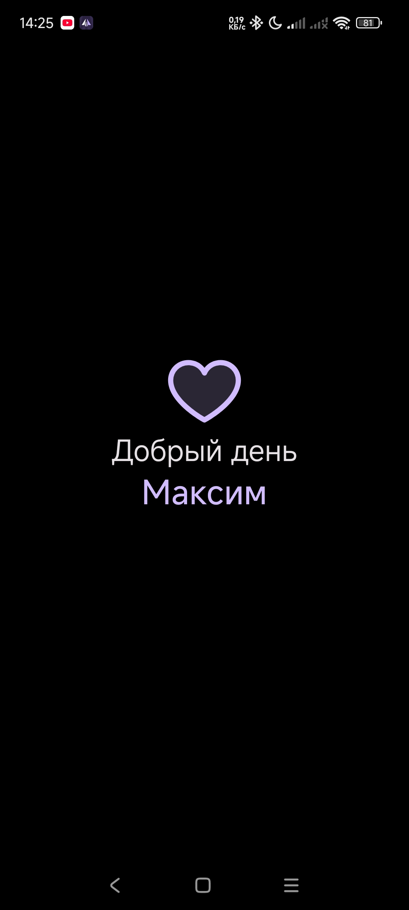
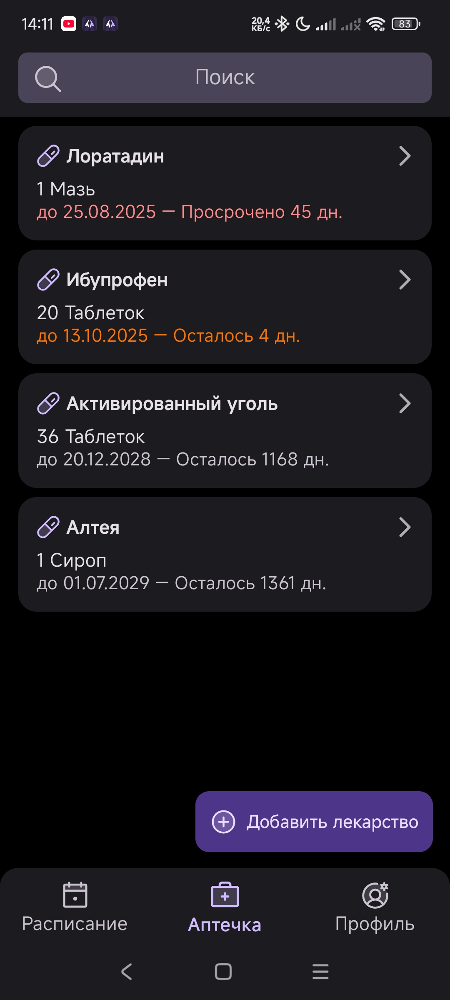
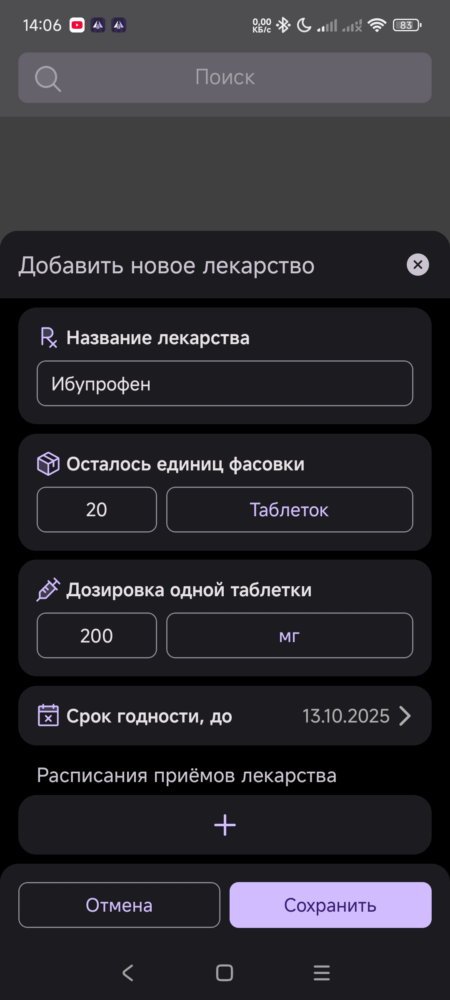
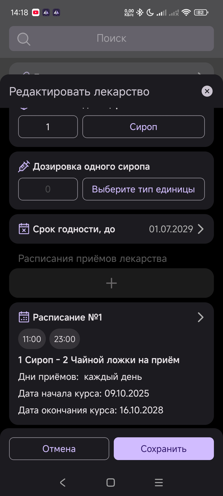
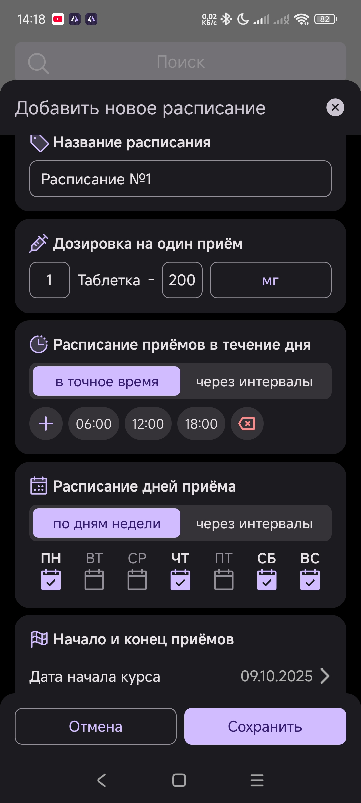
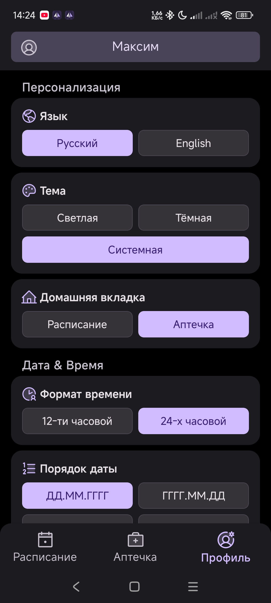

**Language**: [English](README.md) | [Русский](README.ru.md)

# My Medicine Cabinet

A convenient mobile application for managing your home medicine cabinet.
Allows you to track medication expiration dates, set reminders for taking medications, and store a history of treatment courses.

---

## 📖 Features

 Medication Inventory – adding, storing, and updating information (name, dosage, expiration date, quantity).
 Intake Reminders – notifications for the need to take medication at the specified time.
 Expiration Date Control – tracking expired medications and notifying about replacement.
 Intake History – a log of taken medications and treatment course.
 Schedules – creating intake schedules for each medication.

---

# Home Screen

After launching the application, the user sees a concise and stylish greeting. The screen displays , and in the center — 

Above the text, a purple heart outline is placed — an element that adds friendliness and individuality to the interface. The user's name is displayed in a personalized way, creating a sense of care and attention from the application.


<p align="center">
  
</p> 

---

# «Medicine Cabinet» Section

The interface of the "Medicine Cabinet" section provides the user with a convenient way to keep track of their medications. The screen displays a list of medications with key information:

Medication name (highlighted in bold)

Type (e.g., ointment, tablets, syrup)

Quantity

Expiration date and automatic calculation of remaining time or overdue status

Each list item is visually designed as a card with a dark background and color coding:

Red — expired medication

Orange — expiration date is approaching

Light — within the acceptable term

At the top of the screen — a search field, allowing you to quickly find the right medication.

At the bottom, there is an "Add Medicine" button, designed in the brand purple color with a "plus" icon. This makes adding new items to the medicine cabinet intuitive and quick.


<p align="center">
  
</p> 

---

# Interface for Adding New Medicine

The interface is designed in a minimalistic and clear style, allowing the user to quickly enter medication data. All fields are logically structured and accompanied by clear icons:
• Medicine Name — for entering the name.
• Units Left — quantity and type (e.g., tablets, capsules).
• Dosage per Unit — precise indication of the dose in mg, ml, etc.
• Expiration Date — date selection via a convenient calendar.
• Intake Schedule — the ability to add intake time and frequency with one tap.

At the bottom are the "Cancel" and "Save" buttons, providing quick management without unnecessary steps.


<p align="center">
  
</p>

---

# Medicine Editing Interface

The editing page allows the user to quickly change data about an added medication. All parameters are displayed in convenient interactive fields:
• Quantity and Packaging Type — selection of the desired format (e.g., syrup, tablets, etc.).
• Dosage per Unit — the ability to specify the exact dose and measurement type (ml, mg, teaspoons).
• Expiration Date — edited with a single tap using the built-in calendar.
• Medication Intake Schedules — each intake schedule is displayed as a separate block with time, dosage, and course duration.

At the bottom are the "Cancel" and "Save" buttons, making management fast and intuitive.


<p align="center">
  
</p>

---

# Schedule Adding Interface

The screen is designed for creating a personalized medication intake schedule with flexible settings for time, dosage, and course duration.
Main interface elements:
• Schedule name - user can set a clear name for convenience (e.g., "Morning intake").
• Dosage per intake - sets the number of units and dosage in mg, ml, and other units.
• Daily intake schedule - allows selecting exact intake times or setting intervals between them.
• Intake day schedule - selection by days of the week or at specific intervals, depending on the treatment regimen.
• Start and end dates - specifying the course start date with the option to set an end date.

The "Cancel" and "Save" buttons provide simple management and instant schedule saving.


<p align="center">
  
</p>

---

# Profile Interface Brief Description

This is an intuitive and concise settings screen for a mobile application. The interface is organized into thematic blocks, allowing users to easily find and configure needed parameters. All menu items are clearly grouped, making navigation fast and effortless on the eyes.

Key Advantages

1. Full personalization: Users can choose language (Russian/English) and theme (light/dark) for maximum comfort of use.
2. Data display flexibility: Customization of time format (12/24 hour) and date order according to user's familiar standards.
3. Centralized access to main features: Quick selection of the starting tab ("Home", "Schedule", or "Medicine Cabinet") speeds up access to key functions.
4. Simplicity and clarity: Clean design without unnecessary elements, logical structure, and clear wording make working with settings simple and effective.
5. Health orientation: The "Medicine Cabinet" and "Schedule" sections are included in main settings, emphasizing the application's focus on user wellbeing.


<p align="center">
  
</p>

---

## Installation for Users
[At the moment, the installation APK file for Android can be downloaded from the Releases page](https://github.com/ENEIZEM/My-Medicine-Cabinet/releases)
s
Links to Google Play / App Store will appear here in the future


---

# 👨‍💻 For Developers:
Node.js — LTS (install the latest LTS version)

npm (comes with Node) or yarn (optional)

JDK 17+ (required)

Android Studio with Android SDK & Platform Tools installed (for Android builds/emulator)

adb in PATH (Android SDK platform-tools)

(Optional) macOS + Xcode + CocoaPods — if you plan to build the iOS native part

Expo (will be used via npx expo)

For now, the app is available for testing via Expo Go.

---

### Running on Emulator / Physical Device
1) Android Emulator (Android Studio)

Open Android Studio → AVD Manager → create/start an emulator

Make sure adb devices shows the emulator

After npx expo prebuild, go to android/ and run:

```
# inside android directory
./gradlew installDebug
# or via Android Studio — Run → select device
```

---


### Physical Device

Connect the device via USB/ADB and enable USB Debugging

Run:
```
./gradlew installDebug
```

or use
```
npx expo run:android
```

(if configured)

---

### Release Build (Android)

Prepare a keystore (see "Signing" section)

In the project root:

```
npx expo prebuild        # creates android/ if not existing
cd android
./gradlew clean
./gradlew assembleRelease        # .apk in android/app/build/outputs/apk/release/
# or
./gradlew bundleRelease          # .aab for Google Play in android/app/build/outputs/bundle/release/
```

---


### Kotlin Native Module — What and Where to Modify

Kotlin code is usually located in android/app/src/main/java/... or in android/<module>/src/...

If you change the native module interface, don’t forget to:

rebuild the native part (npx expo prebuild if needed, then ./gradlew assembleDebug)

update TypeScript wrappers/types in src/ so JS/TS correctly calls native methods

React Native Autolinking: modern native modules are linked automatically.
For manual linking, modify MainApplication or relevant Gradle files.

---


### Debugging and Logs
JS Logs

Use console.log() + Metro (opens when running npx expo start)

You can also use React Native Debugger or Chrome DevTools

Native Logs (Android)

In a separate terminal:

```
adb logcat
# or filter
adb logcat | grep -E "ReactNative|MyMedicineCabinet|AndroidRuntime"
```


For deeper native debugging — set breakpoints in Android Studio and run from there.

---

### Clearing Caches
Metro:
```
npx expo start -c       # clear cache
# or
npx react-native start --reset-cache
```

Gradle:
```
cd android
./gradlew clean
```

---


### Tests & Static Analysis

TypeScript: tsc --noEmit for type checking

Lint: ESLint + TypeScript rules (.eslintrc configuration)

Unit tests: Jest (recommended) — jest + @testing-library/react-native

E2E: Detox or Appium (if needed, more complex setup)

---


### CI / CD — Basic Recommendation (GitHub Actions)

Typical workflow steps:

checkout

setup-node + npm install (npm ci in CI)

run npm run lint, npm run typecheck, npm test

(optional) build Android debug version (./gradlew assembleDebug) for smoke testing

(optional) publish AAB to Google Play via Fastlane / EAS

If you want, I can generate an example workflow YAML for GitHub Actions.

---

### Common Issues & Quick Fixes

Issue: Expo Go does not detect the native module
Cause: Expo Go does not support custom native modules → use prebuild / dev client / custom build

"Could not find Java" / JDK errors
Check JAVA_HOME, restart terminal / Android Studio

Gradle build failed
Run ./gradlew clean → check Kotlin/Gradle plugin version compatibility

Metro cache issues
npx expo start -c

---


## 🔧 Technologies

· TypeScript
· React Native + Expo (SDK 54)
· Native module in Kotlin

---

## ⚙️ Build and Launch

1. Install Node.js (LTS).
2. Check for JDK 17+ availability.
3. Clone the repository and install dependencies:
     npm install